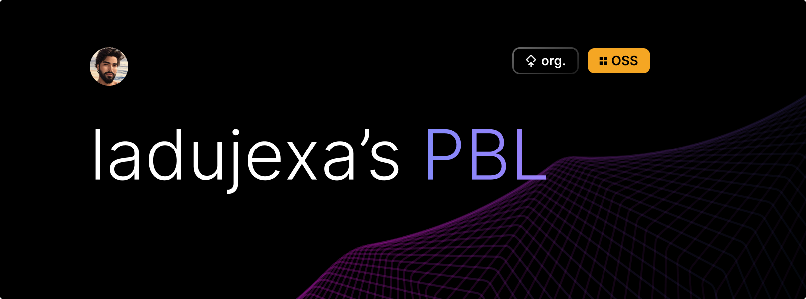

  <h1 align="center" style="border-bottom: none"><b><a href="https://github.com/ladunjexa">@ladunjexa</a>'s PBL Collection</b></h1>
  
## Web Applications

| Name | Description | Technologies | Link |
|-----------------|-------------|------|------|
| "Vanilla Sushi" SPA | "Vanilla Sushi" Web - amazing animated japanese food responsive website with Vite.js using Vanilla & JavaScript 🍣 | Vite, JavaScript,HTML, CSS | [GitHub](https://github.com/ladunjexa-pbl/vanillajs-sushi) |
| eCommerce UI/UX | Sneakers e-Commerce UI Web 🌐 using HTML,CSS & JavaScript - by bedimcode ([@bedimcode](https://github.com/bedimcode)) | JavaScript,HTML, CSS | [GitHub](https://github.com/ladunjexa-pbl/vanillajs-sneakerwie) |
| "ZenAI" SaaS | ZenAI JavaScript AI Image Generator ChatGPT app using OpenAI ML DALL-E models ⚛ | JavaScript, HTML, CSS, Node.js, Express.js  | [GitHub](https://github.com/ladunjexa-pbl/nex-zen-ai) |
| "LunaAI" SaaS | LunaAI JavaScript AI ChatGPT app using OpenAI Machine Learning model ⚛ | JavaScript, HTML, CSS, Node.js, Express.js  | [GitHub](https://github.com/ladunjexa-pbl/nex-luna-ai) |
| AI Image Generator SaaS | Full Stack MERN AI Image Generation App using OpenAI DALL-E model ⚛ | MongoDB, Express.js, React.js, Node.js, Tailwind CSS, Cloudinary | [GitHub](https://github.com/ladunjexa-pbl/mern-dall-e) |
| "Wixie" Social Network PaaS | Incredible Full-Stack Social Network application using MERN Stack 🪐 | MongoDB, Express.js, React.js, Node.js, Materiaul UI, Redux, JWT | [GitHub](https://github.com/ladunjexa-pbl/mern-wixie-social-network) |
| Nike SPA | Dive into the world of Tailwind CSS, incredible Nike website built with Vite.js using TypeScript & React 🪐 | Vite, TypeScript, React, Tailwind CSS | [GitHub](https://github.com/ladunjexa-pbl/reactjs18-nike) |
| "Zexercise" Fitness SPA | Zexercise Fitness App powered by RapidAPI that allows you to browse more than 1300 exercises - using React 18 best practices, and a beautiful UI using the Material UI ⚛ | Node.js, React.js, Material UI | [GitHub](https://github.com/ladunjexa-pbl/reactjs18-fitness) |
| Notes | React Notes App - the best place to jot down quick thoughts or to save longer notes built with React.js ⚛ | React.js, CSS | [GitHub](https://github.com/ladunjexa-pbl/reactjs18-notes) |
| "VirtualSpeakz" AI RTC | phenomenal AI Chat Application integrating clever OpenAI bots for assistant, chat and coding - built with @chatengine-io & @openai api. 🤖 | Vite, React.js, Sass, Redux, Express.js, Chat Engine  | [GitHub](https://github.com/ladunjexa-pbl/reactjs18-virtualspeakz) |
| Summarizer AI SPA | well-designed Article Summarizer Web Application built with React & Redux.js using OpenAI's GPT-4 model powered by Rapid API 🤖 | Vite, React.js, Tailwind CSS, Redux | [GitHub]() |
| "HooBank" SPA | Modern UI/UX webapp consisting of a stunning hero section, high-quality assets and gradients, business stats, reusable components, CTA, testimonials, and much more - built with React.js & Tailwind CSS ⏪ | Vite.js, React.js, Tailwind CSS | [GitHub](https://github.com/ladunjexa-pbl/reactjs18-hoobank) |
| Portfolio SPA | well-designed and functional Personal Portfolio Website consisting Header, Hero, Projects, Technologies, About, Acomplishments and Footer sections built with React & NextJS using styled-components⏭ | Next.js, Styled Components | [GitHub](https://github.com/ladunjexa-pbl/nextjs10-portfolio) |
| Portfolio SPA | stunning Responsive React Portfolio Website consisting Navbar, Landing, Skills, Projects, Testimonials and Footer sections built with React & TailwindCSS 🌈 | React.js, Tailwind CSS | [GitHub](https://github.com/ladunjexa-pbl/reactjs18-portfolio) |
| "Streamlix" PaaS | Streamlix App consisting of stunning video sections, custom categories and much more - using React & MUI-5 powered by RapidAPI ⚛ | Node.js, React.js, Material UI | [GitHub](https://github.com/ladunjexa-pbl/reactjs18-streamlix) |
| "Explorium" PaaS | Explorium Search Engine React app using SEO-API powered by RapidAPI ⚛ | Node.js, React.js, Tailwind CSS | [GitHub](https://github.com/ladunjexa-pbl/reactjs18-explorium) |
| "Flexibble" Pro. Social Network PaaS | Flexibble is an online community and platform for designers, illustrators, and other creative professionals to showcase their work, connect with others in the industry, and find inspiration. 🦄 | TypeScript, Next.js, Tailwind CSS, Auth.js, GraphQL, Cloudinary, JWT, HeadlessUI, Grafbase | [GitHub](https://github.com/ladunjexa-pbl/nextjs13-flexibble) |
| "Hilink" SPA | Dive into the world of Next.js, Incredible Frontend Hilink website built with Next.js using TypeScript & Tailwind CSS ⛺ | TypeScript, Next.js, Tailwind CSS | [GitHub](https://github.com/ladunjexa-pbl/nextjs13-hilink) |
| "CarHub" C2C Marketplace MPA | "CarHub" Web - Easily find detailed specifications for any vehicle - a modern Next.js 13 Application using TypeScript 🏎 | TypeScript, Next.js, TailwindCSS | [GitHub](https://github.com/ladunjexa-pbl/nextjs13-carhub) |
| jQuery SPA Collection | uild 3 Well-designed Websites with HTML, CSS and jQuery | HTML, CSS, jQuery | [GitHub](https://github.com/ladunjexa-pbl/jquery-spa-boilerplates) |
| "PriceWise" Price Tracker  | Dive into web scraping with a Next.js 13 eCommerce price tracker integrated with cheerio, cron jobs, sending emails, and more | TypeScript, Next.js, TailwindCSS, Cheerio, Node-Mailer | [GitHub](https://github.com/ladunjexa-pbl/nextjs13-pricewise) |
| "Nextblog" graphql-based blog | Damazing Responsive Blog Application consisting featured and recent posts, categories, full markdown articles, author information, comments and much more, managed by @hygraph dedicated CMS built with NextJS based on @graphql 📑 | Next.js, GraphQL, Hygraph | [GitHub](https://github.com/ladunjexa-pbl/nextjs13-blog) |
| "Adexa" eCommerce Dashboard | phenomenal Ecommerce Dashboard App consisting Dashboard, Pages, Apps and Charts - built with React & TailwindCSS using @syncfusion ♾️ | React.js, TailwindCSS, React-Router, Syncfusion | [GitHub](https://github.com/ladunjexa-pbl/nextjs13-blog) |
| 3D T-Shirt Customization | stunning ThreeJS 3D Product website corporate with the incredible power of artificial intelligence built with React & Three.js and OpenAI. ⚡ | Vite.js, React.js, Three.js, Framer Motion, Open AI | [GitHub](https://github.com/ladunjexa-pbl/reactjs18-3d-shirt) |
| Prompt AI Assistant | Incredible AI-Prompts Sharing Web Application - modern full-stack Next.js 13 application powered by MongoDB 🤖 | Next.js, TailwindCSS, NextAuth.js, MongoDB (Mongoose) | [GitHub](https://github.com/ladunjexa-pbl/nextjs13-prompt-ai-assistant) |
| "Yariga" Realestate Management Dashboard | phenomenal Realestate Management Dashboard App consisting Dashboard, Properties, Agents and Profiles - built with React & Material-UI using @refinedev ♾️ | React.js, MUI, Refine, Node.js, Express.js, MongoDB (Mongoose), ApexChart.js | [GitHub](https://github.com/ladunjexa-pbl/mern-yariga-dashboard) |

## Mobile Applications

| Name | Description | Technologies | Link |
|-----------------|-------------|------|------|
| Calculator | well-designed Calculator App with theme-mode feature built with React Native Expo & TypeScript ♾️ | React Native (TypeScript), Expo | [GitHub](https://github.com/ladunjexa-pbl/reactnative-calculator) |
| "Jobly" | incredible Job Platform App for Developers powered by Rapid API built with React Native Expo ♾️ | React Native (JavaScript), Expo | [GitHub](https://github.com/ladunjexa-pbl/reactnative-jobly) |

## Courses, Bootcamps, Workshops, and More

| Name | Description | Technologies | Link |
|-----------------|-------------|------|------|
| Full-Stack Web Development Bootcamp | Become a Full-Stack Web Developer with just ONE course. HTML, CSS, Javascript, Node, React, MongoDB, Web3 and DApps - by Angela Yu ([@angelabauer](https://github.com/angelabauer)) | JavaScript, EJS, CSS, HTML | [GitHub](https://github.com/ladunjexa-pbl/full-stack-web-development-bootcamp) |
| Cross-Platform Development Bootcamp with Flutter | Complete Flutter App Development Bootcamp with Dart - created in collaboration with the Google Flutter team - by Angela Yu ([@angelabauer](https://github.com/angelabauer)) | Dart, Flutter | [GitHub](https://github.com/ladunjexa-pbl/cross-platform-development-bootcamp-with-flutter) |
| Advanced CSS and Sass Course  | Advanced CSS and Sass: complex CSS animations, advanced responsive design techniques, flexbox layouts, Sass, CSS architecture, fundamental CSS concepts, and so much more. | JavaScript, SCSS, HTML, CSS | [GitHub](https://github.com/ladunjexa-pbl/advanced-css-and-saas-course) |
| Building Blocks of Web Development Session | HTML, CSS, and JavaScript. Build 10 Big and Complete Responsive Websites with HTML, CSS, and JavaScript | JavaScript, HTML, CSS | [GitHub](https://github.com/ladunjexa-pbl/building-blocks-of-web-development-session) |
| 50 Projects in 50 Days | 50 Projects In 50 Days - HTML, CSS & JavaScript - Sharpen your skills by building 50 quick, unique & fun mini projects - by Brad Traversy ([@bradtraversy](https://github.com/bradtraversy)) | JavaScript, HTML, CSS | [GitHub](https://github.com/ladunjexa-pbl/50-projects-in-50-days) |

 

## Contributing

Pull requests are welcome. For major changes, please open an issue first to discuss what you would like to change.

## License

[licensed under MIT](https://github.com/ladunjexa-pbl/.github/blob/main/LICENSE)
